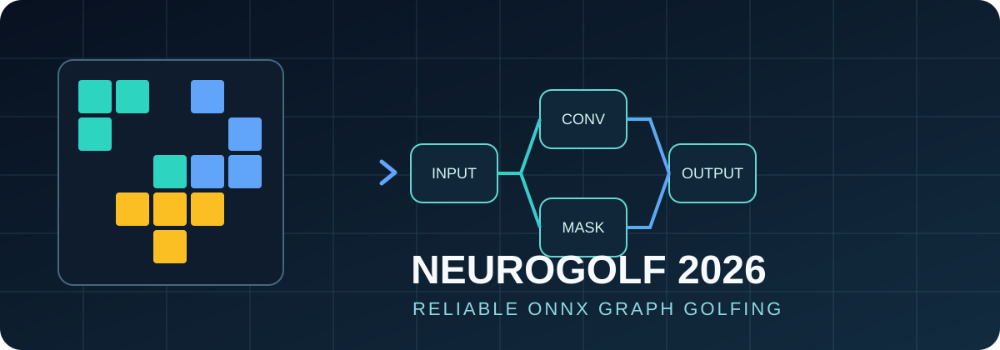
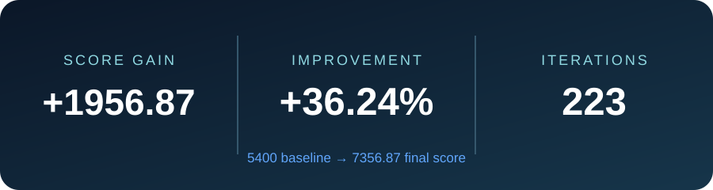
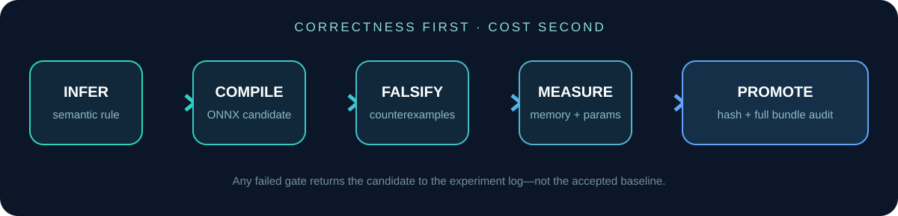

<p align="center">
  
</p>

<p align="center">
  <a href="https://www.kaggle.com/competitions/neurogolf-2026">Competition</a> ·
  <a href="docs/competition.md">Format explained</a> ·
  <a href="docs/methodology.md">Methodology</a> ·
  <a href="docs/onnx-primer.md">ONNX primer</a> ·
  <a href="README.ru.md">Русская версия</a>
</p>

# NeuroGolf 2026: correctness-first ONNX optimization

This repository is a cleaned, reproducible portfolio of my work in **The 2026
NeuroGolf Championship**. I finished with a score of **7356.87** in **540th
place**.

NeuroGolf was unusual for a machine-learning competition. There was no single
model to train. Each of 400 visual reasoning tasks needed its own ONNX graph:
the graph had to reproduce an ARC-style transformation exactly, while using as
little intermediate memory and as few parameters as possible.

<p align="center">
  
</p>

## The problem in one minute

An ARC task presents a few pairs of small coloured grids. The objective is to
infer the transformation—not merely memorize the examples—and encode it as a
static ONNX computation graph. The evaluator then runs that graph on unseen
inputs.

For each correct task, the final competition objective was:

```text
cost   = intermediate tensor memory in bytes + parameter count
points = max(1, 25 - ln(max(1, cost)))
```

Smaller is better, but an incorrect tiny model is worth almost nothing. This
made the work closer to **program synthesis and compiler optimization** than
to conventional model training.

## What I built

- A local scorer for structural checks, parameter counting, static tensor
  memory and the competition point formula.
- Exact one-hot tensor validation across the supplied examples, with ONNX Runtime
  optimizations both disabled and enabled.
- A candidate promotion gate that accepts a rewrite only when it remains exact
  and measurably reduces cost.
- Task analysis utilities for discovering geometric rules and replacing large
  learned graphs with compact semantic constructions.
- Submission discipline based on immutable baselines, SHA-256 identities and
  full-bundle audits.

<p align="center">
  
</p>

## Why validation was the hard part

A candidate could pass every visible example and still fail on a hidden input.
It could also be valid ONNX but behave differently after runtime optimization,
use an unsupported operator, contain a dynamic shape, or become more expensive
after an apparently harmless rewrite.

The practical rule was therefore simple:

```python
if exact_on_known_and_generated_cases(candidate):
    if stable_in_both_runtime_modes(candidate):
        if measured_cost(candidate) < measured_cost(baseline):
            promote(candidate)
```

The real pipeline added independent rule checks, synthetic counterexamples,
shape and dtype audits, model hashes, ZIP diffs and a final 400-model pass. See
[the methodology](docs/methodology.md) for the complete process and the failure
modes it prevented.

## Repository map

```text
.
├── src/neurogolf/       reusable encoding, scoring and validation package
├── examples/            a compact, reproducible ONNX graph builder
├── tests/               unit and graph-construction tests
├── docs/                competition, ONNX and engineering write-ups
├── assets/              original repository graphics
└── data/result.json     final aggregate result (no participant data)
```

Raw competition data, submitted binaries, leaderboard exports and experiment
directories are deliberately excluded. This keeps the repository small,
license-conscious and free of credentials, personal paths and third-party
artifacts.

## Quick start

```bash
python -m venv .venv
# Windows: .venv\Scripts\activate
# macOS/Linux: source .venv/bin/activate
python -m pip install -e ".[dev]"
pytest
```

Build the included one-convolution example:

```bash
python examples/build_neighbor_filter.py model.onnx
neurogolf score model.onnx
```

Validate a model after obtaining the competition data through Kaggle:

```bash
neurogolf validate path/to/task192.onnx path/to/task192.json
neurogolf compare baseline.onnx candidate.onnx path/to/task192.json
```

## Key lessons

1. **Model size is not graph cost.** Intermediate tensors can dominate even
   when the `.onnx` file is small.
2. **Semantic rewrites beat cosmetic cleanup.** Re-expressing the inferred rule
   as one convolution or a small Boolean graph produced the meaningful gains.
3. **Visible examples are necessary, not sufficient.** Counterexample-driven
   tests were the best defence against hidden-distribution failures.
4. **Every optimization needs provenance.** A candidate without a reproducible
   builder, measured cost and validation record is not a result.
5. **Correctness is a gate, not a metric to trade away.** Only then does graph
   golfing begin.

## Scope

This is a post-competition engineering portfolio, not a submission bundle or a
replacement for the official competition package. The scorer intentionally
fails closed when a graph's intermediate shapes cannot be resolved statically;
the official helper remains the source of truth for final compatibility.

Released under the [MIT License](LICENSE).
