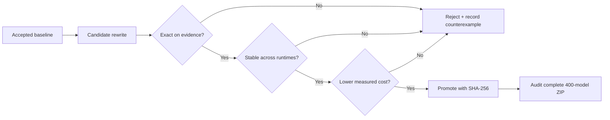

# Methodology: search, validation and promotion

## 1. Establish an immutable baseline

Every task starts with a known-working ONNX model, its measured cost and a
SHA-256 hash. The accepted bundle is never edited in place. Experiments produce
new candidates in isolation, which makes rollback and bundle diffing trivial.

## 2. Infer the semantic rule

The examples are inspected for shape changes, colour roles, connected
components, symmetry, periodicity, bounding boxes and local neighbourhoods.
The goal is a rule that explains all examples and predicts what may vary in
hidden cases.

A rule is first written as a plain grid transformation. This independent form
is easier to reason about than an ONNX graph and becomes an oracle for synthetic
tests.

## 3. Search at two levels

### Mechanical graph rewrites

Low-risk transformations included dead-node pruning, constant simplification,
removing redundant casts and converting diagonal dense convolutions into group
convolutions. These are broad but usually produce small gains.

### Semantic rewrites

The larger gains came from changing representation entirely:

- a local visual predicate encoded as one convolution;
- object detection expressed with grouped convolution and thresholding;
- masks and rays represented with reductions and Boolean operations;
- fixed structure encoded in a small constant instead of a learned stack.

Each semantic graph has a Python builder. The builder—not the opaque `.onnx`
binary—is the reproducible source artifact.

## 4. Validate in layers

Candidates pass through progressively more expensive gates:

1. ONNX checker, allowed-operator and static-shape checks;
2. exact outputs on all supplied train and test examples;
3. exact outputs on generated examples when available;
4. ONNX Runtime with graph optimizations disabled and enabled;
5. differential comparison with the accepted model;
6. comparison with an independent Python rule;
7. synthetic and metamorphic cases varying colour, location, scale, density,
   boundaries and overlap;
8. exact cost measurement;
9. SHA and provenance recording.

The order matters: there is no reason to price an already incorrect graph, and
there is no reason to promote a correct graph that is not cheaper.

## 5. Promote atomically

Only a candidate passing all relevant gates replaces a task model. Before a
submission, the entire 400-file archive is audited—not only the changed tasks.
The ZIP must have canonical filenames, the expected model count and only the
intended hash differences from the previous accepted archive.

## Difficulties and failed directions

### Overfitting visible examples

A shortcut can be perfect on every public grid while encoding the wrong rule.
The fix was not more of the same examples; it was to identify invariants and
actively generate legal counterexamples.

### File-size intuition

Some rewrites reduced serialized bytes but increased intermediate memory. The
measured graph cost, not `.onnx` size or node count, decided promotion.

### Aggressive dtype narrowing

FP16 and small integer types look attractive, but rounding boundaries and
overflow can change an argmax or mask. Narrowing was accepted only after value
range analysis and exact differential tests.

### Runtime-valid versus competition-valid

Passing `onnx.checker`, loading in ONNX Runtime, producing the right visible
outputs and satisfying the competition scorer are separate properties. The
pipeline treats each as its own gate.

### Local gains versus leaderboard gains

Local cost improvements do not help when the candidate fails unseen cases.
This is why the final project emphasizes the validation system more than a
catalogue of isolated graph tricks.

## Result

The final competition result was **7356.87 points and 540th place**. The durable
outcome was a disciplined optimization loop: hypothesize, compile, falsify,
measure and only then promote.
